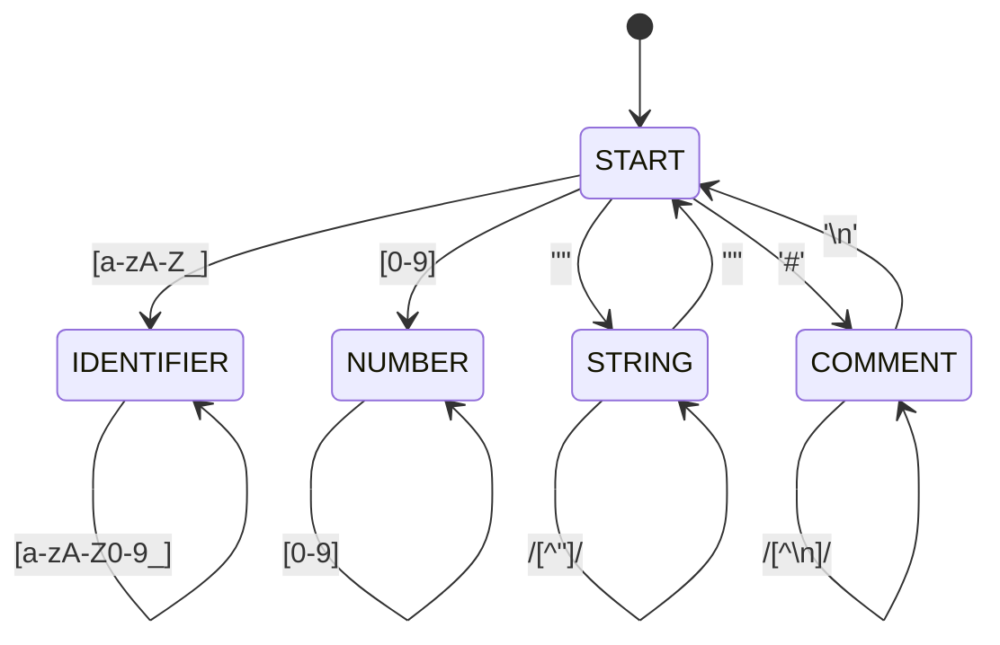
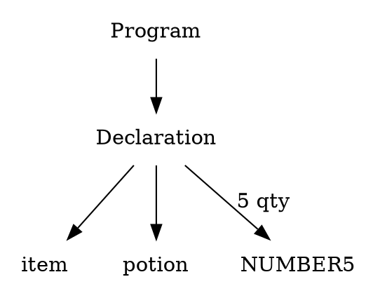

# LootCode Compiler: Design Details

**Date:** May 10, 2026  
**Project:** CS4031 Compiler Construction - LootCode

---

## 1. Lexical Analysis (Phase 1)

### 1.1 Token Categories and Regular Expressions

| Token Type | Regular Expression | Examples |
|------------|-------------------|----------|
| KEYWORD | `(item\|stat\|loop\|if\|then\|else\|quest)` | `item`, `stat`, `loop` |
| IDENTIFIER | `[a-zA-Z_][a-zA-Z0-9_]*` | `player_hp`, `potion`, `x` |
| NUMBER | `[0-9]+(\.[0-9]+)?` | `42`, `3.14`, `100` |
| STRING | `"([^"\\]|\\.)*"` | `"Hello"`, `"You win!"` |
| UNIT | `(qty\|hp\|mp\|turns)` | `qty`, `hp`, `mp`, `turns` |
| OPERATOR | `(=\|\+\|-\|\*\|/\|==\|!=\|>\|<\|>=\|<=)` | `=`, `+`, `==`, `>=` |
| DELIMITER | `(;\|,\|\(|\)\|{\|})` | `;`, `,`, `(`, `)`, `{`, `}` |
| COMMENT | `#[^\n]*` | `# This is a comment` |

---

### 1.2 Lexer DFA / State Transition Table

The lexer is implemented as a deterministic finite automaton (DFA). Below is a compact transition table for main token types.

| Current State | Input Class | Next State | Emit/Action |
|---------------|-------------|------------|-------------|
| START         | [a-zA-Z_]   | IDENT | accumulate char |
| IDENT         | [a-zA-Z0-9_] | IDENT | accumulate |
| IDENT         | else        | START | emit IDENT/KEYWORD |
| START         | [0-9]       | NUMBER | accumulate |
| NUMBER        | [0-9]       | NUMBER | accumulate |
| NUMBER        | '.'         | DECIMAL | accumulate |
| DECIMAL       | [0-9]       | DECIMAL_FRAC | accumulate |
| START         | '"'        | STRING | accumulate until '"' |
| STRING        | '"'        | START  | emit STRING |
| START         | '#'         | COMMENT | consume until newline |
| COMMENT       | '\n'       | START  | ignore/comment ended |
| START         | '='         | START  | emit ASSIGN or check next '=' for EQ |
| START         | '+'         | START  | emit PLUS |
| START         | ';'         | START  | emit SEMICOLON |

---

### 1.3 Example Tokenization

Input: `item potion = 5 qty;`

Output tokens: `[KEYWORD(item), IDENTIFIER(potion), ASSIGN(=), NUMBER(5), UNIT(qty), SEMICOLON(;)]`

---

## 2. Syntax Analysis (Phase 2)

### 2.1 Complete Grammar (CFG, no left recursion)

```
<Program>        → <Statement>*

<Statement>      → <Declaration> | <Assignment> | <Operation> | <Control>

<Declaration>    → 'item' IDENTIFIER '=' NUMBER UNIT ';'
                 | 'stat' IDENTIFIER '=' NUMBER UNIT ';'

<Assignment>     → IDENTIFIER '=' <Expr> UNIT ';'

<Expr>           → <Term> (('+' | '-') <Term>)*

<Term>           → <Factor> (('*' | '/') <Factor>)*

<Factor>         → NUMBER | IDENTIFIER | '(' <Expr> ')'

<Operation>      → 'narrate' STRING ';'
                 | 'show' IDENTIFIER ';'
                 | 'combine' IDENTIFIER 'with' IDENTIFIER ';'
                 | 'equip' IDENTIFIER 'to' <Expr> UNIT ';'
                 | 'rest' <Expr> UNIT ';'

<Control>        → <LoopStmt> | <IfStmt>

<LoopStmt>       → 'loop' NUMBER 'iterations' '{' <Statement>* '}'

<IfStmt>         → 'if' <Condition> 'then' '{' <Statement>* '}' ('else' '{' <Statement>* '}')?

<Condition>      → <Expr> <CompOp> <Expr>

<CompOp>         → '==' | '!=' | '>' | '<' | '>=' | '<='
```

Notes:
- Expression precedence handled by Term/Factor hierarchy.
- Left recursion removed by using repetition forms.

---

### 2.2 Parse Tree Example 1: Declaration + Assignment

Input: `item potion = 5 qty; potion = 3 qty;`

ASCII parse tree:

```
<Program>
  ├─ <Declaration>
  │   ├─ item
  │   ├─ potion
  │   ├─ =
  │   └─ 5 qty
  └─ <Assignment>
      ├─ potion
      ├─ =
      └─ 3 qty
```

### 2.3 Parse Tree Example 2: Loop with Conditional

Input:
```
loop 2 iterations {
  if player_hp > 0 then { narrate "Attack!"; }
}
```

ASCII parse tree:

```
<Program>
 └─ <LoopStmt>
     ├─ loop
     ├─ 2
     └─ <Body>
         └─ <IfStmt>
             ├─ if
             ├─ <Condition>
             │   ├─ player_hp
             │   └─ 0
             └─ <Then>
                 └─ <Operation> (narrate "Attack!")
```

---

## 3. Semantic Analysis (Phase 3)

### 3.1 Symbol Table (stack of scopes)

Design outline (Python-style pseudocode):

```python
class SymbolEntry:
    def __init__(self, name, type, unit, value=None, line=None, scope_level=0):
        self.name = name
        self.type = type
        self.unit = unit
        self.value = value
        self.line = line
        self.scope_level = scope_level

class SymbolTable:
    def __init__(self):
        self.scopes = [{}]  # list of dicts, scopes[-1] is current
        self.scope_level = 0

    def enter_scope(self):
        self.scopes.append({})
        self.scope_level += 1

    def exit_scope(self):
        self.scopes.pop()
        self.scope_level -= 1

    def declare(self, name, type, unit, line):
        if name in self.scopes[-1]:
            raise SemanticError("Redeclaration")
        entry = SymbolEntry(name, type, unit, line=line, scope_level=self.scope_level)
        self.scopes[-1][name] = entry

    def lookup(self, name):
        for scope in reversed(self.scopes):
            if name in scope:
                return scope[name]
        return None

    def update(self, name, value):
        entry = self.lookup(name)
        if entry:
            entry.value = value
        else:
            raise SemanticError("Undefined variable")
```

### 3.2 Symbol Table Example and Scope Visualization

Program sample:

```adventurescript
stat global_hp = 100 hp;   # Line 1
loop 2 iterations {        # Line 3 (enter scope 1)
  item local_potion = 5 qty; # Line 4
  global_hp = global_hp - 10 hp; # Line 5
}                          # exit scope 1
if global_hp > 0 then {     # Line 7 (enter scope 2)
  stat battle_damage = 20 hp; # Line 8
}
```

Symbol table progression:

- After Line 1 (Global Scope):
```
Scope 0 (Global): global_hp: (stat, hp, 100)
```

- Inside Loop (Scope 1):
```
Scope 0: global_hp: (stat, hp, 100)
Scope 1: local_potion: (item, qty, 5)
```

- After Loop exit:
```
Scope 0: global_hp updated to 90 (local_potion removed)
```

- Inside If (Scope 2):
```
Scope 0: global_hp: (stat, hp, 90)
Scope 2: battle_damage: (stat, hp, 20)
```

### 3.3 Type Checking Rules (summary)

- Declarations fix type and unit.
- Arithmetic: operands must have same unit; result preserves unit.
- `combine` requires `item` operands.
- `equip` requires a `stat` and compatible unit.
- Assignments require RHS unit == LHS unit.

Example error:
```
potion = potion + player_hp qty
→ SemanticError: unit mismatch (qty vs hp)
```

### 3.4 Complete Symbol Table Reference (Filled Table)

The filled symbol table should be written in the same stage-by-stage style as the detailed diagram so the scope changes are easy to verify.

### Stage 1: After Line 1 (Global Scope Only)

| Name | Type | Unit | Value | Line Declared | Scope Level | Status |
|------|------|------|-------|---------------|-------------|--------|
| global_hp | stat | hp | 100 | 1 | 0 (Global) | Active |

### Stage 2: Inside Loop (Two Scopes)

| Name | Type | Unit | Value | Line Declared | Scope Level | Status |
|------|------|------|-------|---------------|-------------|--------|
| global_hp | stat | hp | 100 | 1 | 0 (Global) | Active |
| local_potion | item | qty | 5 | 4 | 1 (Loop) | Active |

### Stage 3: After Loop Exit (Global Scope Only, Updated Value)

| Name | Type | Unit | Value | Line Declared | Scope Level | Status |
|------|------|------|-------|---------------|-------------|--------|
| global_hp | stat | hp | 90 | 1 | 0 (Global) | Active |

### Stage 4: Inside If Block (Two Scopes)

| Name | Type | Unit | Value | Line Declared | Scope Level | Status |
|------|------|------|-------|---------------|-------------|--------|
| global_hp | stat | hp | 90 | 1 | 0 (Global) | Active |
| battle_damage | stat | hp | 20 | 8 | 2 (If block) | Active |

### Stage 5: After If Block Exits (Global Scope Only)

| Name | Type | Unit | Value | Line Declared | Scope Level | Status |
|------|------|------|-------|---------------|-------------|--------|
| global_hp | stat | hp | 90 | 1 | 0 (Global) | Active |

**Key observations:**
- Each entry tracks its declaration line for error reporting.
- Scope level determines nesting depth (0 = global, 1+ = nested blocks).
- When a scope exits, all variables at that scope level are removed.
- Values are updated in place during execution, so `global_hp` changes from 100 to 90 after the loop.
- The Stage 4 table matches the filled symbol table shown inside the If-block scope visualization.

### 3.5 Type Checking Trace (Step-by-Step)

Program to check:
```adventurescript
stat player_hp = 100 hp;        # Line 1
item potion = 5 qty;            # Line 2
potion = potion + 5 qty;        # Line 3
player_hp = player_hp - 10 hp;  # Line 4
```

Type checking process for each line:

| Line | Statement | Check | Result |
|------|-----------|-------|--------|
| 1 | `stat player_hp = 100 hp` | Declare stat with unit hp, assign value 100 | ✓ OK - add to symbol table |
| 2 | `item potion = 5 qty` | Declare item with unit qty, assign value 5 | ✓ OK - add to symbol table |
| 3 | `potion = potion + 5 qty` | Lookup potion (item, qty); Add 5 qty; Result type=item unit=qty; Assign to potion (item, qty) | ✓ OK - types match (qty == qty) |
| 4 | `player_hp = player_hp - 10 hp` | Lookup player_hp (stat, hp); Subtract 10 hp; Result type=stat unit=hp; Assign to player_hp (stat, hp) | ✓ OK - types match (hp == hp) |

**Type checking errors would occur if:**
```
Line 3 had: potion = potion + 5 hp    → ✗ FAIL: unit mismatch (qty ≠ hp)
Line 4 had: player_hp = potion - 10   → ✗ FAIL: different types (stat ≠ item)
```

### 3.6 Variable Lookup with Scope Stack

When the semantic analyzer needs to find a variable, it searches the scope stack from innermost to outermost (reverse order).

**Program:**
```adventurescript
stat global_x = 10 hp;              # Line 1
loop 2 iterations {                 # Line 2 → enter Scope 1
  item local_y = 5 qty;             # Line 3
  global_x = global_x + 0 hp;       # Line 4: lookup global_x
}                                   # exit Scope 1
```

**Lookup for `global_x` at Line 4:**

Current scope stack when line 4 is being analyzed:
```
Scope Stack = [
  0: {global_x: (stat, hp, 10)},     ← Scope 0 (Global)
  1: {local_y: (item, qty, 5)}       ← Scope 1 (Loop, current)
]
```

**Search process:**
1. Check Scope 1 (current): Does it have `global_x`? NO
2. Check Scope 0 (parent): Does it have `global_x`? YES → Found!
3. Return: `(stat, hp, 10)` from Scope 0

**If the lookup was for `local_y`:**
1. Check Scope 1 (current): Does it have `local_y`? YES → Found!
2. Return: `(item, qty, 5)` from Scope 1 (never need to search parent)

**If lookup fails (e.g., for undefined variable `battle_reward`):**
1. Check Scope 1 (current): Does it have `battle_reward`? NO
2. Check Scope 0 (parent): Does it have `battle_reward`? NO
3. All scopes exhausted → Raise `SemanticError: Undefined variable 'battle_reward'`

---

## 4. Integration Example (end-to-end)

Input program (short):

```adventurescript
stat player_hp = 100 hp;
stat enemy_hp = 50 hp;
loop 2 iterations {
  if player_hp > 0 then {
    player_hp = player_hp - 10 hp;
    enemy_hp = enemy_hp - 5 hp;
  }
}
```

- Lexical phase produces tokens (STAT, IDENT, ASSIGN, NUMBER, UNIT, etc.)
- Parser builds AST with Declarations and Loop/If statements
- Semantic analyzer builds symbol table and validates unit compatibility

---

## 5. Diagrams — how to create them (easy instructions)

If you cannot embed graphical diagrams in the report, follow these quick steps to produce them and include images in your submission. Below are simple, practical options (no advanced tools needed).

1) DFA / State-Transition Diagram
- Use draw.io (diagrams.net) or the online Mermaid live editor.
- Steps (draw.io):
  - Open https://app.diagrams.net/ → New Diagram → Blank.
  - Add rounded rectangles for states: `START`, `IDENTIFIER`, `NUMBER`, `STRING`, `COMMENT`, etc.
  - Use arrows for transitions and label with input character classes (e.g. `[a-zA-Z_]`, `[0-9]`, `"`, `#`, `=`).
  - Export as PNG/SVG and place in your report.
- Mermaid example (paste into Mermaid editor):



2) Parse Trees (visual)
- Use plain text ASCII trees (already included) or Graphviz/Dot for images.
- Graphviz steps:
  - Install Graphviz (Windows: choco install graphviz or download installer).
  - Create DOT file for a parse tree:



  - Run: `dot -Tpng tree.dot -o tree.png` and include the PNG.

3) Symbol Table / Scope Visualization
- Use a simple table or rectangle blocks in draw.io showing scope stack (Global → Loop → If).
- Alternatively, use a markdown table or ASCII box (already present) and include it.

4) Tips for submission
- Keep PNG or SVG files next to your docs (e.g., `docs/diagrams/dfa.png`).
- In `COMPILER_ARCHITECTURE_DOCUMENT.md` or `COMPILER_DESIGN_DETAILS.md`, add image links:

```markdown

```

5) If you prefer automated Mermaid → PNG conversion:
- Use the Mermaid CLI (`npm i -g @mermaid-js/mermaid-cli`) then:

```bash
mmdc -i dfa.mmd -o dfa.png
```

That completes the design-details document. If you want, I can generate Mermaid files for the DFA and sample parse trees here and save them into `docs/diagrams/` so you can convert or embed them directly.
